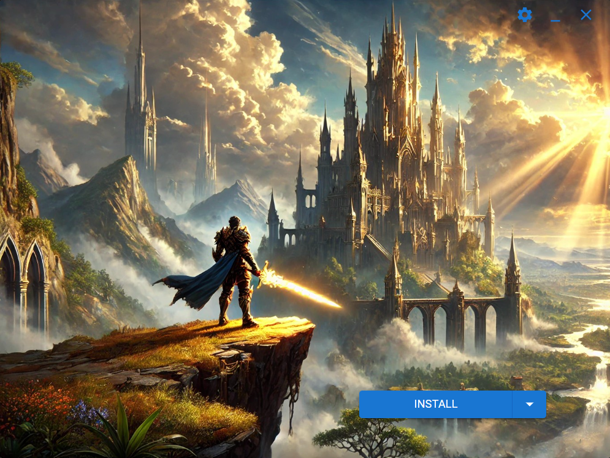

<div align="center">

 
**Sparus**

**A cross-platform game launcher built with Tauri — start and keep your game up-to-date.**

[](https://github.com/Ludea/Sparus/releases/latest)
[](LICENSE)
[](https://github.com/Ludea/Sparus)
[](https://github.com/Ludea/Sparus)

</div>

---

## Overview

Sparus is a lightweight, customisable game launcher available on **Windows**, **macOS**, **Linux**, and **Android**. It handles game installation, updates, and launch — all from a single desktop (or mobile) application built on top of [Tauri v2](https://tauri.app/).

The frontend is built with **React 19** + **MUI v9**, while the backend is written in **Rust**. A **Module Federation** runtime is included to allow dynamic plugin loading at runtime.

---

## Ecosystem

[Lucle](https://github.com/ludea/lucle), a cms with an admin dashboard to manage binaries versions 

## Features

- 🎮 **Launch & update** — installs and keeps your game up-to-date via a remote `state.json` manifest
- 🔔 **Update notifications** — notifies the user when a launcher or game update is available
- 📦 **Split button** — single button that adapts its label/action (Install / Play / Update / Restart)
- 🧩 **Plugin system** — dynamic module loading via `@module-federation/runtime`
- 🤖 **Android support** — APK build with keystore signing and dev host handling
- 🔒 **CSP-compliant** — proper Content Security Policy for WebView2 (Windows) and other platforms
- 💾 **Persistent config** — stores user preferences via `@tauri-apps/plugin-store`
- 📣 **System notifications** — native OS notifications via `@tauri-apps/plugin-notification`
- 🚀 **Auto-start** — optional launcher auto-start on system boot

---

## Screenshot

<p align="center">


<p align="center">

## Tech Stack

| Layer    | Technology                                                   |
| -------- | ------------------------------------------------------------ |
| Desktop  | [Tauri v2](https://tauri.app/)                               |
| Frontend | React 19, React Router 7, MUI v9, Emotion                    |
| Backend  | Rust, Wasmtime (WASM plugin runtime)                         |
| Plugins  | `@module-federation/runtime` (dynamic remote loading)        |
| Build    | [vite-plus](https://viteplus.dev/) (`vp`), TypeScript 6      |
| Mobile   | Android (Kotlin), APK signing via keystore                   |
| CI       | GitHub Actions (Linux, Windows, macOS x86_64/arm64, Android) |

---

## Prerequisites

### All platforms

- [Rust](https://www.rust-lang.org/tools/install) (stable toolchain)
- [vite-plus](https://viteplus.dev/) — unified toolchain (`vp`) that manages Node.js and the package manager automatically

  **macOS/Linux:**

  ```bash
  curl -fsSL https://viteplus.dev/install.sh | sh
  ```

  **Windows:**
  Download and run [`vp-setup.exe`](https://viteplus.dev/)

### Platform-specific

**Windows**

```
WebView2 Runtime (usually pre-installed on Windows 11)
```

**macOS**

```
Xcode Command Line Tools: xcode-select --install
```

**Linux (Debian/Ubuntu)**

```bash
sudo apt update && sudo apt install \
  libwebkit2gtk-4.1-dev \
  build-essential \
  curl wget \
  libssl-dev \
  libgtk-3-dev \
  libappindicator3-dev \
  librsvg2-dev
```

**Android**

- Android SDK + NDK
- Set `ANDROID_HOME`, `NDK_HOME`, and a keystore file for signing (see CI config for reference)

---

## Getting Started

### 1. Clone the repository

```bash
git clone https://github.com/Ludea/Sparus.git
cd Sparus
vp install
```

### 2. Configure the launcher

Copy the sample configuration into `src-tauri/`:

```bash
cp src-tauri/Sparus-sample.json src-tauri/Sparus.json
```

Edit `Sparus.json` to point to your game's remote update server and set default values (game name, binary, repository URL, etc.).

### 3. Run in development mode

```bash
vp tauri dev
```

> **Android dev:** set `TAURI_DEV_HOST` to your machine's local IP so the WebView on the device can reach the Vite dev server.

### 4. Build for production

```bash
vp tauri build
```

Binaries are output to `src-tauri/target/release/`.

> ⚠️ **Cross-compilation is not supported.** Build on the target platform.

---

## Project Structure

```
Sparus/
├── src/                   # React frontend (TypeScript)
├── src-tauri/             # Rust backend (Tauri)
│   ├── src/               # Rust source files
│   ├── Sparus-sample.json # Sample launcher config (copy to Sparus.json)
│   └── tauri.conf.json    # Tauri configuration
├── index.html
├── vite.config.ts
└── package.json
```

---

## Configuration (`Sparus.json`)

The launcher reads a `Sparus.json` file from the Tauri resource directory at startup. The file is created with defaults on first run if it does not exist.

Key fields include the remote server URL for the game manifest (`state.json`), the game binary name, and the subfolder structure expected on the server.

---

## Releases

Pre-built binaries for Windows, macOS, Linux, and Android are published on the [Releases page](https://github.com/Ludea/Sparus/releases).

| Platform | Artifact             |
| -------- | -------------------- |
| Windows  | `.msi` / `.exe`      |
| macOS    | `.dmg`               |
| Linux    | `.AppImage` / `.deb` |
| Android  | `.apk`               |

---

## Contributing

Contributions are welcome! Please open an issue first for any significant change, then submit a pull request against `main`.

1. Fork the repository
2. Create a feature branch: `git checkout -b feat/my-feature`
3. Commit your changes following [Conventional Commits](https://www.conventionalcommits.org/)
4. Open a pull request

---

## License

Distributed under the **Apache-2.0** license. See [LICENSE](LICENSE) for details.
